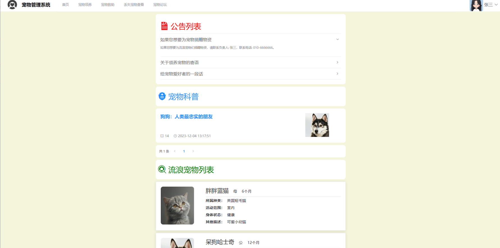
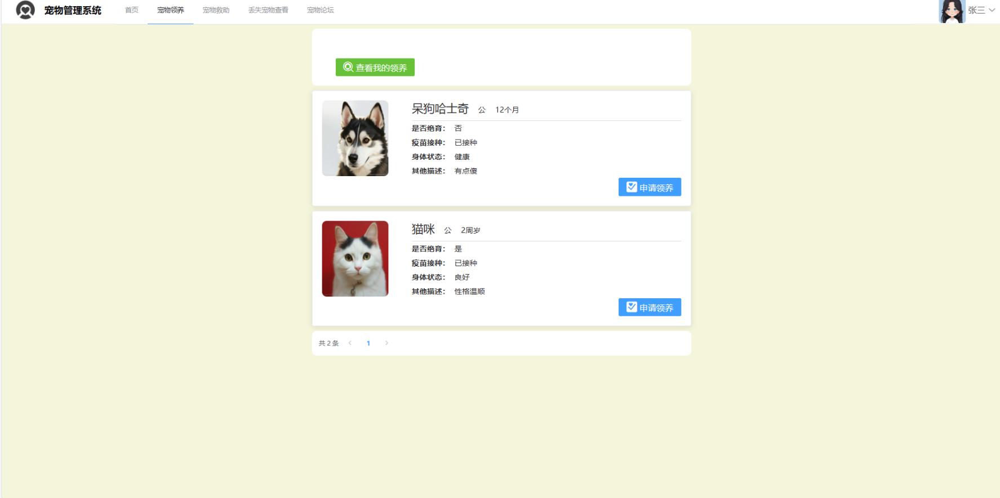
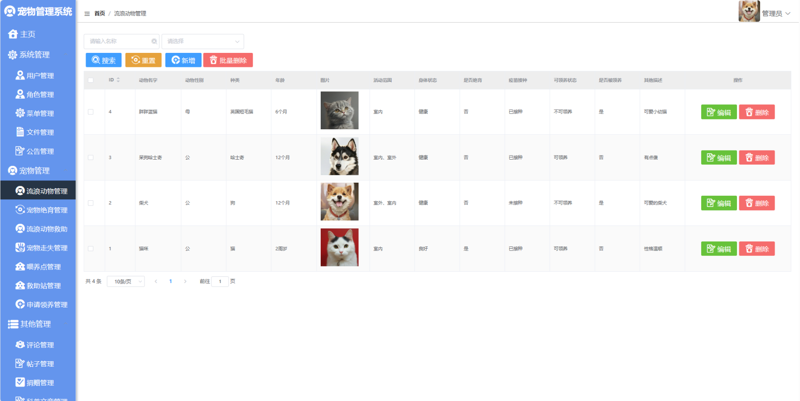
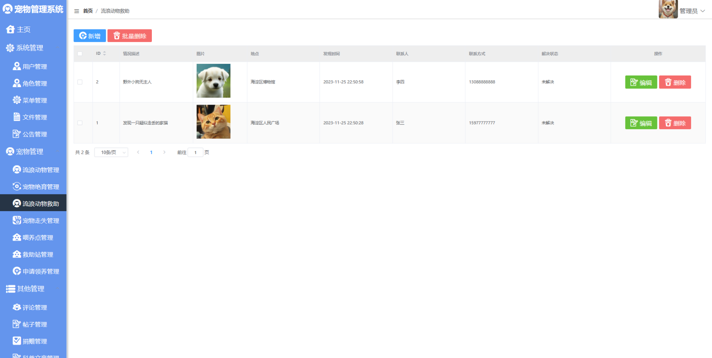
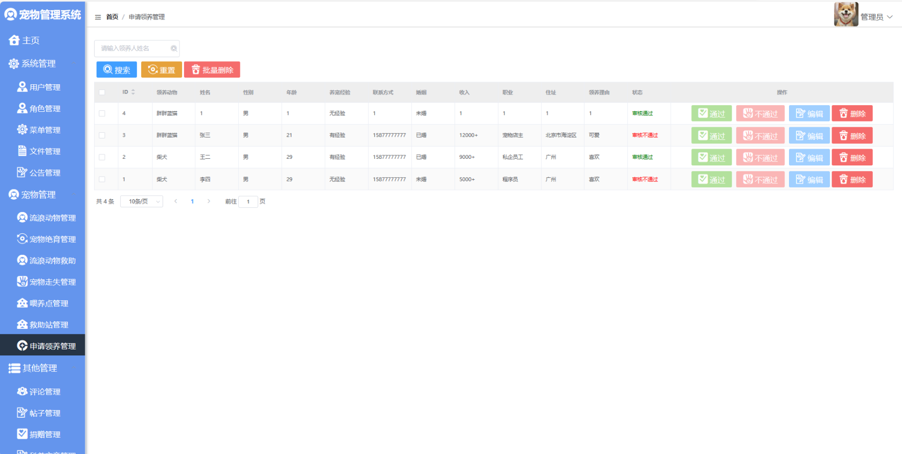
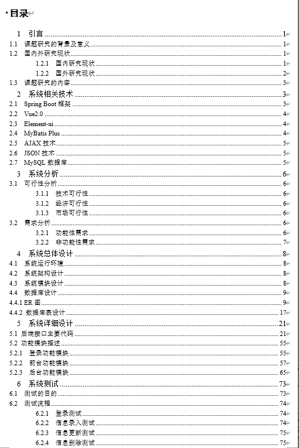
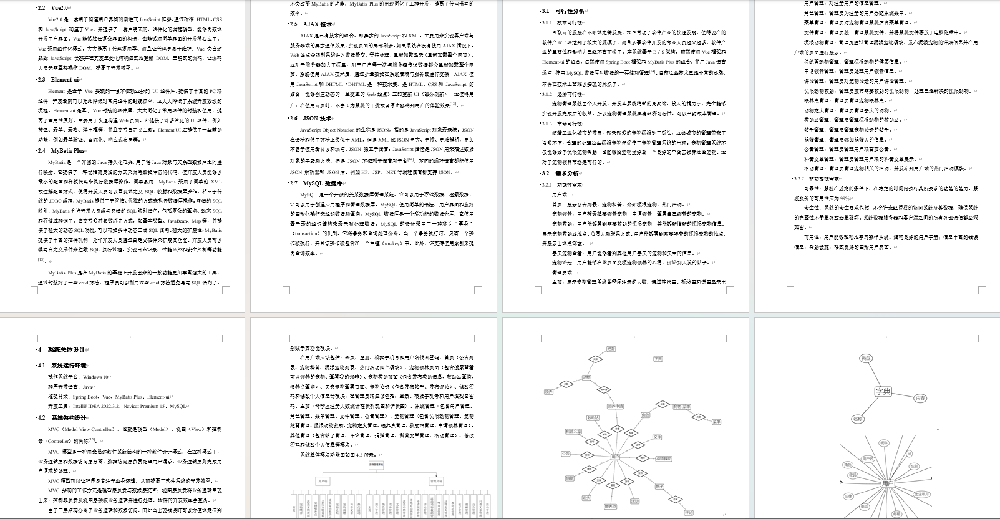

# 宠物管理系统带万字论文

### 完整项目获取

通过网盘分享的文件：宠物管理系统

链接: https://pan.baidu.com/s/13moUY5o-vU9kehn2D3Lj8g?pwd=arrm 提取码: arrm --来自百度网盘超级会员v3的分享

通过网盘分享的文件：工具包

链接: https://pan.baidu.com/s/1YmdoJvkjoUjA75wvHLDZ6A?pwd=xm96 提取码: xm96
--来自百度网盘超级会员v3的分享

需要远程项目部署或项目修改和毕业设计也可联系（添加申请时请备注好来意）

通过网盘分享的文件：远程调试部署联系方式

链接: https://pan.baidu.com/s/1W0dDcoZmayG0c7USJDYBYg?pwd=nqd7 提取码: nqd7
--来自百度网盘超级会员v3的分享

### 项目合集(项目不断更新中)
链接: https://pan.baidu.com/s/1nY-zhvAK0CXYcn3g7LzQnQ?pwd=id3c 提取码: id3c
--来自百度网盘超级会员v3的分享

#### 这些项目一起发你了 可以分享给你需要的同学 调试可找我 也接二次修改和项目定制、毕业设计等

## 接毕业设计和论文

微信联系方式：xzxj0206  QQ：3808981644   (支持修改、 部署调试、 支持代做毕设)

接网站建设、小程序、H5、APP、各种系统等，单片机、嵌入式也可以做

选题+开题报告+任务书+程序定制+安装调试+论文+答辩ppt  都可以做

## 一、介绍

基于springboot+vue的前后端分离宠物管理系统

开发语言：java

运行环境:idea或eclipse vscode 数据库:mysql

前端技术：Vue、ELementUI、echarts

后端技术：SpringBoot、Mybatis-Plus

系统角色：用户、管理员

1、用户的主要功能：

首页：展示公告列表，宠物科普，介绍流浪宠物，热门活动
注册、登录、宠物领养、宠物救助、丢失宠物查看、宠物论坛

2、管理员的主要功能：

用户管理、申请领养管理、评论管理、流浪动物救助、动物走失管理、救助站管理、帖子管理、捐赠管理、公告管理、科普文章管理、活动管理等

## 二、部分页面截图展示

## 三、19000字论文参考

